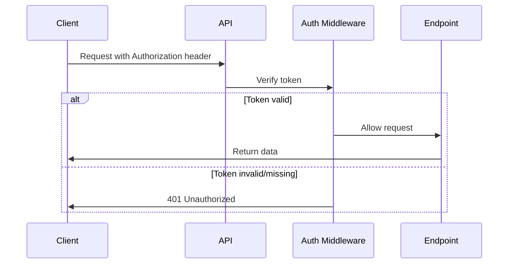

## Overview

The Bastion API uses token-based authentication via the `Authorization` header. This simple but effective method ensures that only authorized clients can access your bot's data.

## Configuration

### Setting Your Auth Token

Configure authentication in your `settings.yaml` file:

```yaml settings.yaml
# Bastion API Auth
# Auth for accessing the Bastion API Server.
# If auth isn't set the API server won't start.
auth: "your-secret-auth-token-here"
```

Alternatively, use the environment variable:

```bash
export BASTION_API_AUTH="your-secret-auth-token-here"
```

<Warning>
The environment variable `BASTION_API_AUTH` takes precedence over the value in `settings.yaml`.
</Warning>

## Making Authenticated Requests

Include your auth token in the `Authorization` header with every API request.

### Example Requests

<CodeGroup>

```bash cURL
curl -H "Authorization: your-secret-auth-token-here" \
  http://localhost:8377/status
```

```javascript JavaScript (fetch)
const response = await fetch('http://localhost:8377/status', {
  headers: {
    'Authorization': 'your-secret-auth-token-here'
  }
});

const data = await response.json();
console.log(data);
```

```python Python (requests)
import requests

headers = {
    'Authorization': 'your-secret-auth-token-here'
}

response = requests.get('http://localhost:8377/status', headers=headers)
data = response.json()
print(data)
```

```javascript Node.js (axios)
const axios = require('axios');

const response = await axios.get('http://localhost:8377/status', {
  headers: {
    'Authorization': 'your-secret-auth-token-here'
  }
});

console.log(response.data);
```

</CodeGroup>

## Authentication Flow

The authentication process is straightforward:

1. Client sends request with `Authorization` header
2. Server extracts the header value
3. Server compares it with the configured auth token
4. If they match, the request proceeds
5. If they don't match or the header is missing, returns `401 Unauthorized`



## Error Responses

### 401 Unauthorized

Returned when authentication fails:

```json
{
  "message": "Unauthorized",
  "status": 401
}
```

Common causes:
- Missing `Authorization` header
- Incorrect token value
- Token doesn't match the configured auth value

## Security Best Practices

<AccordionGroup>
  <Accordion title="Use Strong Tokens">
    Generate a strong, random token for your auth value. Use at least 32 characters with a mix of letters, numbers, and special characters.
    
    ```bash
    # Generate a secure token using OpenSSL
    openssl rand -hex 32
    ```
  </Accordion>

  <Accordion title="Keep Tokens Secret">
    - Never commit auth tokens to version control
    - Use environment variables in production
    - Rotate tokens periodically
    - Don't share tokens in logs or error messages
  </Accordion>

  <Accordion title="Network Security">
    - Use HTTPS in production (add reverse proxy like nginx)
    - Restrict API access to trusted networks
    - Consider using a VPN for remote access
    - Implement additional security layers if exposing publicly
  </Accordion>

  <Accordion title="Token Storage">
    Store your auth token securely:
    - Use environment variables in production
    - Use secret management services (AWS Secrets Manager, HashiCorp Vault)
    - Never hardcode tokens in application code
  </Accordion>
</AccordionGroup>

<Note>
The auth middleware is located in `src/middlewares/auth.ts` and performs a simple string comparison between the provided token and configured value.
</Note>

## Troubleshooting

### API Server Not Starting

If the API server doesn't start:

1. Verify both `port` and `auth` are set in `settings.yaml`
2. Check for environment variable overrides
3. Ensure the port is not already in use
4. Review bot startup logs for errors

### Authentication Failing

1. Verify the token matches exactly (no extra spaces)
2. Check you're using the `Authorization` header (not `Bearer` prefix)
3. Confirm environment variables aren't overriding your settings
4. Test with a simple cURL request first

## Implementation Details

The authentication is handled by a custom Express middleware:

```typescript
// From src/middlewares/auth.ts
export default (req: Request, _: Response, next: NextFunction): void => {
    const settings = new Settings();
    const authorization: string = req.get("Authorization");

    if (authorization && authorization === settings.auth) next();
    else next(httpError(401));
};
```

<Info>
The middleware checks if the `Authorization` header exactly matches the configured auth token. No encoding or hashing is performed.
</Info>